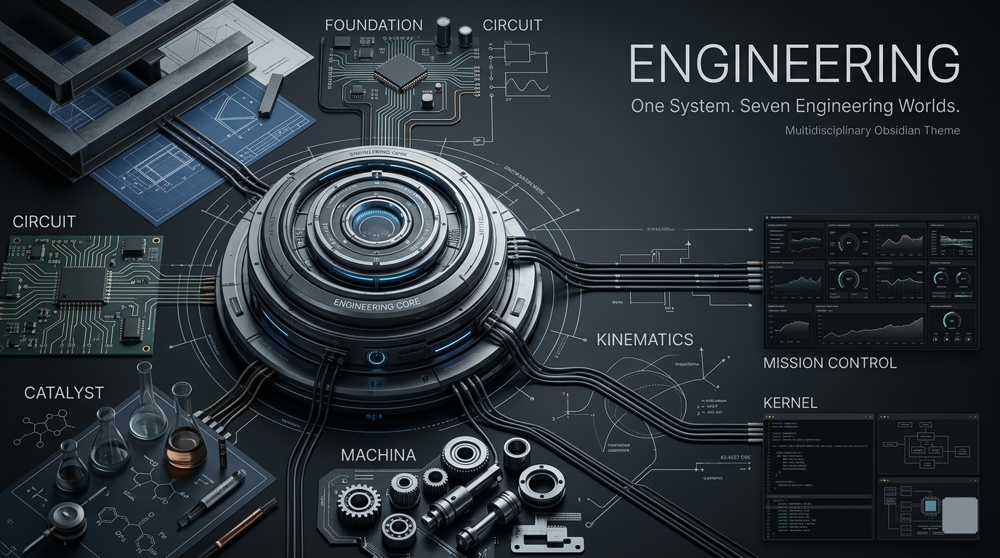
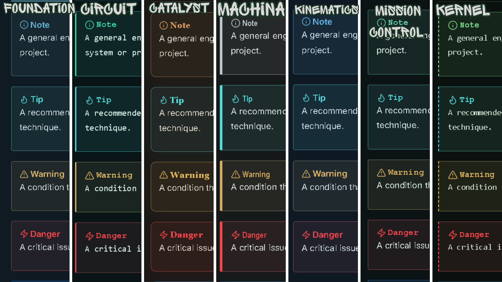

# Engineering


**A multidisciplinary Obsidian theme built around seven engineering disciplines, each with its own visual language, atmosphere, and design system.**

Engineering transforms your vault into a structured technical environment — where notes become documentation, links become system connections, properties become specifications, tables become engineering schedules, and knowledge grows as an interconnected system.

Designed for **engineers, architects, developers, researchers, scientists, students, technical writers, makers, planners, and anyone who works with complex information, structured ideas, systems, and processes.**

---

## Preview



> **One system. Seven disciplines. A workspace built for structured thinking.**

---

## Engineering Disciplines

Engineering contains seven distinct disciplines.

They are **not simply colour presets**. Each discipline represents a different engineering environment and can change the overall visual design of the workspace.

| Discipline | Colour | Engineering Focus |
|---|---|---|
| 🏗️ **Foundation** | Steel Blue | Structure, architecture, documentation |
| ⚡ **Circuit** | Teal Green | Electronics, signals, connectivity |
| 🧪 **Catalyst** | Copper Amber | Chemistry, experiments, materials |
| ⚙️ **Machina** | Graphite Steel | Mechanical systems, machines, manufacturing |
| 📐 **Kinematics** | Industrial Blue | Motion, geometry, dynamics |
| 🛰️ **Mission Control** | Slate Blue | Operations, monitoring, coordination |
| 💻 **Kernel** | Charcoal Blue | Software, systems, terminals |

Each discipline shares the same Engineering foundation while creating a different technical environment for your vault.

---

## Screenshots

### Engineering — Dark Mode


A dark technical environment showcasing all seven Engineering disciplines.

### Engineering — Light Mode


A clean light environment showcasing all seven Engineering disciplines.

### Callouts



Engineering-style panels for notes, warnings, specifications, references, and important information.

---

## Features

| Feature | Description |
|---|---|
| 🏗️ **Seven Disciplines** | Foundation, Circuit, Catalyst, Machina, Kinematics, Mission Control, and Kernel |
| 🎨 **Complete Discipline Systems** | Each discipline creates its own engineering atmosphere |
| 🌑 **Dark Mode** | Technical dark workspace |
| ☀️ **Light Mode** | Dedicated light-mode environment |
| 🔗 **System Links** | Links represent relationships between ideas |
| 📊 **Engineering Tables** | Structured presentation for technical data |
| 💻 **Code Blocks** | Technical documentation and programming surfaces |
| 🗂️ **Properties** | Specification-style metadata |
| 🏷️ **Tags** | Compact technical classification |
| ☑️ **Tasks** | Clear work-order and project states |
| 📋 **Callouts** | Engineering documentation panels |
| 📐 **Canvas** | Technical workspace for diagrams and planning |
| 📱 **Mobile** | Responsive mobile interface |

---

## Engineering Is More Than a Colour Theme

The seven disciplines are not seven different colour schemes.

Each discipline represents a different engineering environment.

Changing the discipline can affect:

- Interface colours
- Background and panel surfaces
- Typography
- Spacing and visual density
- Borders and separators
- Buttons and interactive elements
- Tables and data presentation
- Code surfaces
- Callouts
- Properties
- Navigation
- Overall visual hierarchy

> **Choose the engineering environment that fits the way you work.**

---

# The Seven Engineering Worlds

| Discipline | Colour | Focus |
|---|---|---|
| 🏗️ **Foundation** | Steel Blue | Architecture, structure, documentation |
| ⚡ **Circuit** | Teal Green | Electronics, signals, connectivity |
| 🧪 **Catalyst** | Copper Amber | Chemistry, materials, experiments |
| ⚙️ **Machina** | Graphite Steel | Machines, mechanics, manufacturing |
| 📐 **Kinematics** | Industrial Blue | Motion, geometry, dynamics |
| 🛰️ **Mission Control** | Slate Blue | Operations, monitoring, coordination |
| 💻 **Kernel** | Charcoal Blue | Software, terminals, systems |

> **Seven disciplines. One engineering system.**

---

# Changing the Engineering Discipline

Engineering uses the **Style Settings** community plugin to control its discipline system.

The Style Settings plugin is required to switch between the seven Engineering disciplines or customize the theme.

## Install Style Settings

1. Open **Obsidian**.
2. Open **Settings**.
3. Select **Community plugins**.
4. Click **Browse**.
5. Search for **Style Settings**.
6. Select **Style Settings**.
7. Click **Install**.
8. Click **Enable**.

> **Style Settings is a separate Obsidian community plugin. It is not included with the Engineering theme.**

## Select a Discipline

1. Open **Settings**.
2. Go to **Style Settings**.
3. Find the **Engineering** section.
4. Locate **Engineering Discipline**.
5. Select your preferred discipline.

The Engineering theme will apply the selected discipline.

> **Changing the discipline changes the overall Engineering environment, not just its colour.**

Your notes, files, content, and vault structure remain unchanged.

---

## Built for Structured Thinkers

Engineering is suited for:

- 🏗️ Civil & Structural Engineers
- 📐 Architects & Designers
- ⚡ Electrical & Electronics Engineers
- ⚙️ Mechanical Engineers
- 💻 Software Engineers
- 🧪 Chemical & Materials Scientists
- 📐 Physicists & Researchers
- 🛰️ Systems & Operations Engineers
- 🔬 Researchers & Scientists
- 🧑‍💻 Developers
- 📚 Technical Writers
- 🎓 Engineering Students
- 📋 Project Planners
- 🧠 Knowledge Managers
- 🛠️ Makers & System Designers

Designed for anyone who thinks in **systems, structures, relationships, processes, hierarchy, dependencies, and organized information**.

---

# Design Philosophy

Engineering is built around a simple idea:

> **A knowledge vault is a system.**

Different parts of the vault represent different parts of an engineered environment.

- **Notes** become technical documents.
- **Folders** become systems and modules.
- **Links** become system connections.
- **Tags** become classifications.
- **Properties** become specifications.
- **Tasks** become work orders.
- **Tables** become engineering schedules.
- **Canvas** becomes a technical design board.
- **Code** becomes the computational layer.
- **Callouts** become engineering annotations.
- **Disciplines** become different engineering environments.

> **Structure before decoration.**

---

# Engineering System

```text
                         ENGINEERING
                              │
             ┌────────────────┼────────────────┐
             │                │                │
        FOUNDATION         CIRCUIT          CATALYST
         Structure       Connectivity      Transformation
             │                │                │
             └────────────────┼────────────────┘
                              │
             ┌────────────────┼────────────────┐
             │                │                │
          MACHINA        KINEMATICS      MISSION CONTROL
         Mechanics          Motion           Operations
             │                │                │
             └────────────────┼────────────────┘
                              │
                           KERNEL
                          Computing
```

Each discipline has its own identity while remaining part of the same Engineering design system.

---

# Technical Design Language

Engineering takes subtle inspiration from:

- Technical drawings
- Engineering schematics
- Architectural documentation
- Laboratory notes
- Mechanical diagrams
- System architecture
- Control rooms
- Computer terminals
- Technical specifications
- Scientific documentation

The goal is **professional technical atmosphere, not decoration**.

---

# Typography

- **Body:** IBM Plex Sans
- **Headings:** IBM Plex Sans
- **Technical:** IBM Plex Mono

Typography is designed to feel **precise, professional, technical, and highly readable**.

---

# Installation

1. Download the Engineering theme.
2. Copy the theme folder to:

```text
YourVault/.obsidian/themes/
```

3. Open **Obsidian → Settings → Appearance**.
4. Select **Engineering**.
5. Install and enable **Style Settings** if you want to change the Engineering discipline.

---

# Compatibility

| Feature | Status |
|---|---|
| Desktop | ✅ |
| Mobile | ✅ |
| Dark Mode | ✅ |
| Light Mode | ✅ |
| Live Preview | ✅ |
| Properties | ✅ |
| Tables | ✅ |
| Callouts | ✅ |
| Code Blocks | ✅ |
| Dataview | ✅ |
| Tasks | ✅ |
| Canvas | ✅ |
| Excalidraw | ✅ |

---

# Screenshots

```text
screenshots/
├── dark.png
├── light.png
└── callouts.png
```

The Dark and Light screenshots showcase all seven Engineering disciplines. The Callouts screenshot demonstrates the theme's technical information panels.

---

# Support ☕

If you enjoy Engineering and want to support development:

<a href="https://www.buymeacoffee.com/CosmicSeaFox" target="_blank">

</a>

<a href="https://ko-fi.com/cosmicseafox" target="_blank">

</a>

---

# Credits

**Fonts**

- IBM Plex Sans
- IBM Plex Mono

Inspired by engineering disciplines, technical documentation, architectural drawings, scientific systems, mechanical design, electronics, computing, operations, and structured knowledge systems.

Made for the Obsidian community.

---

# License

MIT License

**Engineering — One system. Seven disciplines.**
