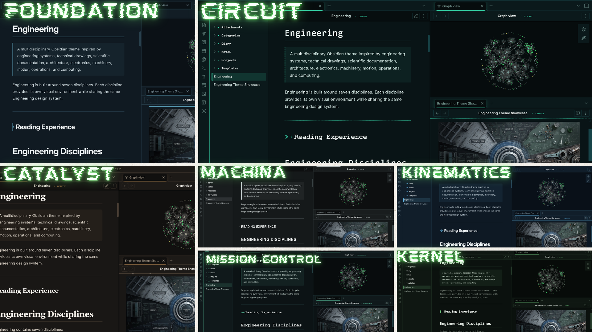
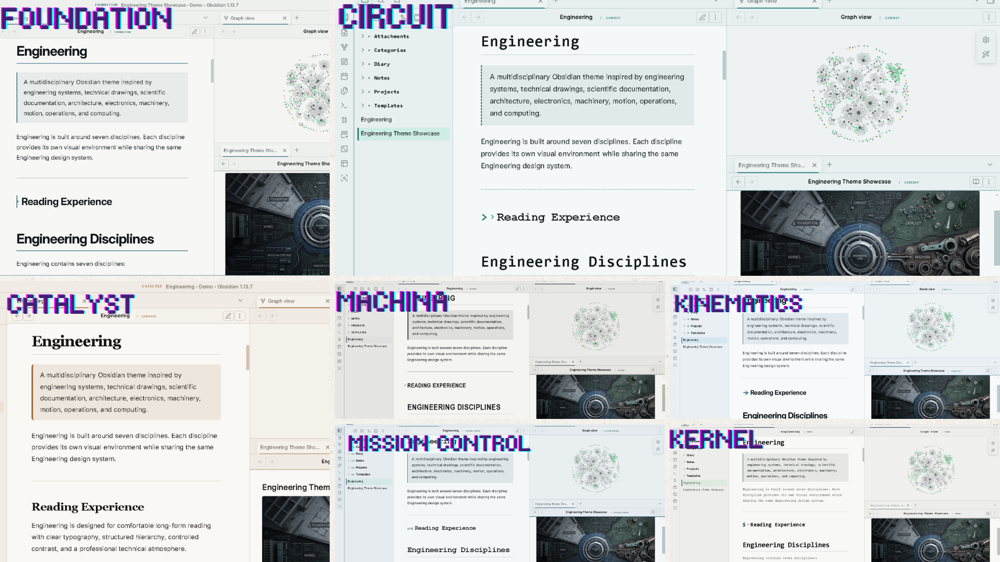

# ⚙️ Engineering — Obsidian Theme


> **One system. Seven disciplines. A workspace built for structured thinking.**

**Engineering** transforms Obsidian into a technical workspace inspired by blueprints, circuit boards, laboratory records, CAD drawings, telemetry systems, and computer terminals.

It is not simply a colour theme.

**Your vault becomes the engineering environment.**

---

## Preview

<p align="center">
  
</p>

<p align="center">
  
</p>

> **Structure before decoration.**

---

# Seven Engineering Worlds

| Discipline | Environment | Built For |
|---|---|---|
| 🏗️ **Foundation** | Blueprint & structure | Architecture · Documentation |
| ⚡ **Circuit** | PCB & connectivity | Electronics · Embedded |
| 🧪 **Catalyst** | Laboratory & materials | Chemistry · Research |
| ⚙️ **Machina** | CAD & machinery | Mechanical · Manufacturing |
| 📐 **Kinematics** | Motion & geometry | Physics · Robotics |
| 🛰️ **Mission Control** | Telemetry & operations | Systems · Monitoring |
| 💻 **Kernel** | Terminal & systems | Software · Infrastructure |

**One foundation. Seven visual languages.**

Switch disciplines through **Style Settings** and transform the atmosphere of your entire vault.

---

# What Makes It Different

| System | Engineering Treatment |
|---|---|
| 🗂️ **Properties** | Technical metadata and specifications |
| 🔗 **Links** | System connections |
| 📊 **Tables** | Engineering schedules |
| ☑️ **Tasks** | Work orders & project states |
| 📋 **Callouts** | Technical annotations |
| 🕸️ **Graph** | Discipline-specific system atmosphere |
| 💻 **Code** | Computational layer |
| 🎨 **Discipline** | Complete visual environment |

### ⚡ New in 1.1.0

| Update | What Changed |
|---|---|
| **Technical Fields** | Measurements and specifications use technical typography |
| **Property Artifacts** | Seven disciplines receive distinct property designs |
| **Graph Atmosphere** | Blueprint, PCB, laboratory, CAD, telemetry & terminal environments |
| **Better Light Mode** | Designed as technical documentation rather than inverted dark mode |
| **Responsive Properties** | Long technical fields remain readable |
| **Cleaner Tables** | No zebra striping, distracting hover effects, or unnecessary `!important` |
| **Accessibility** | Contrast, reduced motion, focus states, and non-color indicators |
| **Mobile** | Responsive properties, tables, spacing, and touch targets |
| **Print / PDF** | Cleaner technical documents when exported |

---

# The Engineering Language

Engineering gives familiar Obsidian features a technical role:

```text
NOTES       → Technical Documents
FOLDERS     → Systems & Modules
LINKS       → Connections
TAGS        → Classifications
PROPERTIES  → Specifications
TASKS       → Work Orders
TABLES      → Engineering Schedules
CANVAS      → Design Board
CODE        → Computational Layer
CALLOUTS    → Technical Annotations
GRAPH       → System Network
```

> **A knowledge vault is a system.**

---

# Graph View

The graph becomes part of the Engineering discipline system.

| Discipline | Graph Atmosphere |
|---|---|
| 🏗️ Foundation | Blueprint network |
| ⚡ Circuit | PCB signal map |
| 🧪 Catalyst | Laboratory reaction network |
| ⚙️ Machina | CAD assembly |
| 📐 Kinematics | Vector field |
| 🛰️ Mission Control | Telemetry display |
| 💻 Kernel | Terminal dependency map |

Each environment changes the visual language of the graph through nodes, edges, tags, backgrounds, grids, and subtle atmosphere.

Designed to remain **technical without becoming visual noise**.

---

# Built for Structured Thinkers

**Architecture · Civil · Structural · Electrical · Electronics · Mechanical · Chemical · Materials · Physics · Robotics · Software · Systems · Research · Technical Writing · Planning**

If you think in:

**systems · structures · relationships · dependencies · processes · specifications**

Engineering was built for you.

---

# Installation

### 01 — Install Engineering

Place the theme inside:

```text
YourVault/.obsidian/themes/Engineering/
```

Then open:

**Settings → Appearance → Themes → Engineering**

### 02 — Install Style Settings

Install the **Style Settings** community plugin.

Then open:

**Settings → Style Settings → Engineering → Engineering Discipline**

Choose:

```text
Foundation
Circuit
Catalyst
Machina
Kinematics
Mission Control
Kernel
```

Your notes, files, links, and vault structure remain unchanged.

Only the **engineering environment** changes.

---

# Compatibility

| Feature | Status |
|---|:---:|
| Desktop | ✅ |
| Mobile | ✅ |
| Dark Mode | ✅ |
| Light Mode | ✅ |
| Live Preview | ✅ |
| Properties | ✅ |
| Tables | ✅ |
| Callouts | ✅ |
| Code Blocks | ✅ |
| Canvas | ✅ |
| Dataview | ✅ |
| Tasks | ✅ |
| Excalidraw | ✅ |
| Print / PDF | ✅ |

---

# Technical Design

Inspired by:

**Engineering Drawings · Blueprints · PCB Layouts · Laboratory Records · CAD Systems · Control Rooms · Telemetry · Terminals · Technical Documentation**

### Typography

- **IBM Plex Sans** — interface & documentation
- **IBM Plex Mono** — technical values & code

> **Professional technical atmosphere, not decoration.**

---

# Roadmap

Engineering is designed as a living technical system.

Future development will focus on:

- More discipline-specific components
- Deeper graph customization
- Additional technical document styles
- Mobile refinements
- Improved print and document workflows

---

# ☕ Support

If Engineering is useful in your workflow, you can support development:

<p align="center">
  <a href="https://www.buymeacoffee.com/CosmicSeaFox" target="_blank">
    
  </a>
  &nbsp;
  <a href="https://ko-fi.com/cosmicseafox" target="_blank">
    
  </a>
</p>

---

# Credits

**Fonts**

IBM Plex Sans · IBM Plex Mono

Inspired by engineering disciplines, technical documentation, architecture, scientific systems, mechanical design, electronics, computing, operations, and structured knowledge.

Made for the **Obsidian community**.

---

# License

**MIT License**

---

<p align="center">

## ⚙️ Engineering

**One system. Seven disciplines.**

</p>